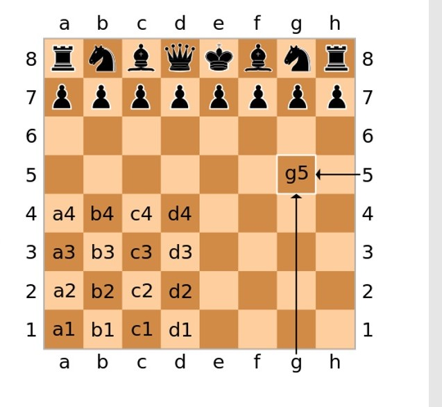

# Assegnazione Progetto

Progetto assegnato: *scacchi*
* Applicazione per il gioco 2-players degli scacchi, con interfaccia a linea di comando (CLI) 
* Le mosse sono descritte in notazione algebrica (https://it.wikipedia.org/wiki/Notazione_algebrica) 
  - 1.e4e5  

  - 2.Cf3Cc6  

  - 3.d4  

